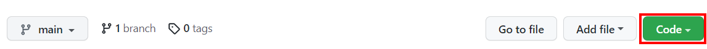
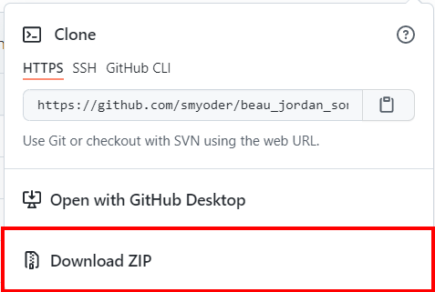
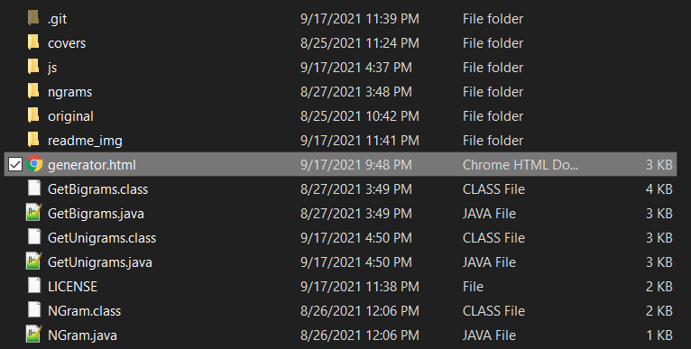
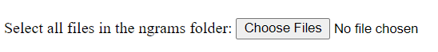
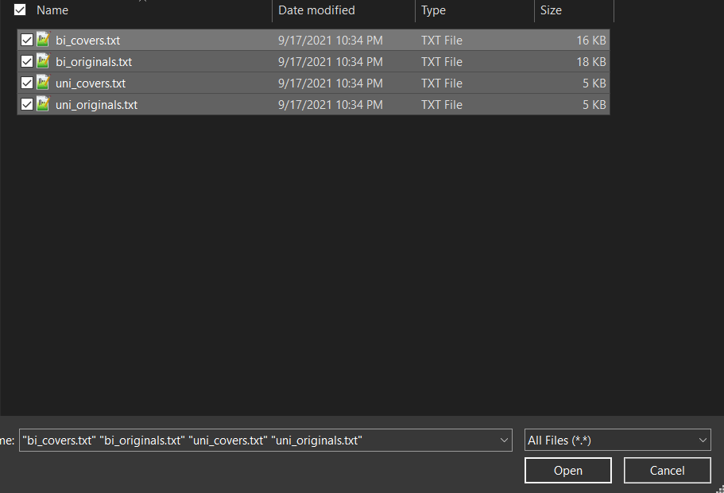
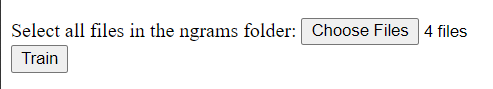
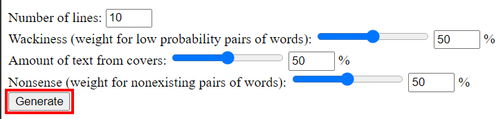

# Instructions

## Downloading
1. Click the green code button towards the top right of the screen

2. Click "Download ZIP"

3. Save the ZIP file somewhere on your computer and extract it.

## Running
1. Open the file called "generator.html" in your browser.

2. Click the button that appears in the web page. It should read "Choose Files" or something similar.

3. Select and open all the files in the "ngrams" folder (Unfortunately, this cannot be done automatically in most modern browsers).

4. Click the button that says "Train."

5. Adjust the settings to your liking and click the button that says "Generate."

6. Repeat step 5 as many times as you want!
7. Have fun!